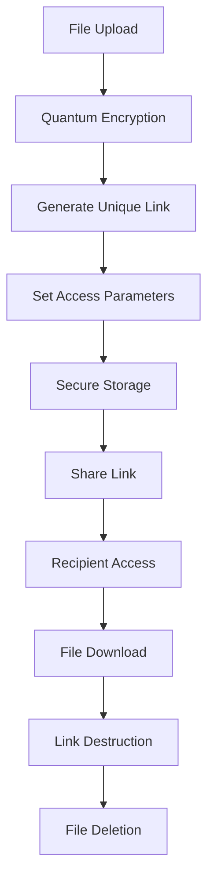

# NEXHACK 🔐
### Next-Generation Quantum-Safe Cybersecurity Platform

[](https://github.com/AnushaHardaha/ROOTBLUE)
[](https://opensource.org/licenses/MIT)
[](https://github.com/AnushaHardaha/ROOTBLUE/releases)
[](https://github.com/AnushaHardaha/ROOTBLUE)

---

## 🎯 Overview

**NEXHACK** is a cutting-edge cybersecurity platform engineered to provide **quantum-resistant communication, ultra-secure file sharing, and comprehensive APK threat analysis**. In an era where quantum computing threatens traditional encryption methods, NEXHACK stands as a fortress of digital security, ensuring your data remains protected against both current and future threats.

Our platform combines **post-quantum cryptography**, **zero-trust architecture**, and **advanced threat detection** to create an ecosystem where security isn't just a feature—it's the foundation.

### 🌟 Mission Statement
> *"To provide unbreakable security in a quantum computing world, where every message, file, and application is protected by tomorrow's cryptographic standards, available today."*

---

## 🚀 Core Features

### 🔒 Quantum-Safe Messaging Engine
Our messaging system is built on **NIST-approved post-quantum cryptographic algorithms**, ensuring your communications remain secure even against quantum computer attacks.

#### Key Features:
- **Post-Quantum Encryption**: Implementation of CRYSTALS-Kyber for key encapsulation and CRYSTALS-Dilithium for digital signatures
- **Perfect Forward Secrecy**: Each message uses unique encryption keys that are destroyed after use
- **End-to-End Encryption**: Messages are encrypted on sender's device and only decrypted on recipient's device
- **Quantum Key Distribution (QKD)**: Optional integration for maximum security
- **Message Burn**: Auto-delete messages after specified time or read count
- **Secure Group Messaging**: Support for encrypted group conversations with up to 1000 participants
- **Cross-Platform Sync**: Secure synchronization across all devices without compromising security

#### Technical Specifications:
```
Encryption Algorithm: AES-256-GCM (for data encryption after key exchange)
Key Encapsulation (Key Exchange): CRYSTALS-Kyber-1024 (PQC KEM)
Digital Signature: CRYSTALS-Dilithium-5 (PQC Signature)
Hash Function: SHA3-512
Message Authentication: HMAC-SHA3-256
```

### 📂 One-Time Secure File Sharing System
Revolutionary file sharing that ensures **true ephemeral access** with military-grade security protocols.

#### Advanced Features:
- **Unique Link Generation**: Each file gets a cryptographically secure, one-time access URL
- **Automatic Link Expiry**: Links self-destruct after download, specified time, or access attempts
- **File Encryption**: AES-256 encryption with post-quantum key exchange
- **Access Control**: Granular permissions with IP whitelisting and device fingerprinting
- **Download Verification**: Cryptographic proof of successful file transfer
- **Steganographic Options**: Hide files within images for covert transmission
- **File Integrity Check**: SHA-3 checksums ensure file hasn't been tampered with
- **Bandwidth Optimization**: Intelligent compression without security compromise

#### File Sharing Workflow:


#### Supported File Types:
- **Documents**: PDF, DOC, DOCX, TXT, RTF, ODT
- **Images**: JPG, PNG, GIF, BMP, TIFF, SVG, WEBP
- **Audio**: MP3, WAV, FLAC, AAC, OGG
- **Video**: MP4, AVI, MOV, MKV, WMV
- **Archives**: ZIP, RAR, 7Z, TAR, GZ
- **Code**: All programming language files
- **Maximum File Size**: 10GB per file

### 📱 Advanced APK Security Scanner
Comprehensive Android Package analysis system that provides detailed security assessment using multiple detection engines and behavioral analysis.

#### Deep Analysis Capabilities:

##### 🦠 Malware Detection Engine
- **Static Analysis**: Bytecode examination and pattern matching
- **Dynamic Analysis**: Sandbox execution with behavior monitoring
- **Heuristic Detection**: AI-powered threat identification
- **Signature Database**: Real-time updates from global threat intelligence
- **Zero-Day Detection**: Machine learning models for unknown threats

##### 🔑 Permission Analysis System
- **Privacy Risk Assessment**: Categorizes permissions by risk level
- **Permission Usage Tracking**: Monitors how permissions are actually used
- **Unnecessary Permission Detection**: Identifies over-privileged applications
- **Permission Correlation**: Analyzes permission combinations for suspicious patterns
- **User-Friendly Reports**: Clear explanations of what each permission means

##### ✅ Certificate & Signature Verification
- **Digital Certificate Validation**: Verifies developer authenticity
- **Certificate Chain Analysis**: Checks entire certification path
- **Signature Integrity Check**: Ensures APK hasn't been modified
- **Developer Reputation**: Cross-references with known malicious developers
- **Certificate Transparency**: Monitors certificate issuance for anomalies

##### 🌐 Network Behavior Analysis
- **Traffic Pattern Analysis**: Monitors network communication patterns
- **Suspicious Domain Detection**: Identifies connections to malicious servers
- **Data Exfiltration Detection**: Monitors for unauthorized data transmission
- **C&C Server Identification**: Detects command and control communications

#### APK Analysis Report Structure:
```
📊 SECURITY VERDICT: SAFE ✅ / UNSAFE ❌ / SUSPICIOUS ⚠️

🔍 QUICK SUMMARY
├── Overall Risk Score: X/100
├── Malware Probability: X%
├── Privacy Risk Level: Low/Medium/High
└── Recommendation: Install/Caution/Block

📱 APPLICATION INFO
├── Package Name: com.example.app
├── Version: 1.0.0
├── Developer: Developer Name
├── File Size: XX MB
├── Target SDK: Android XX
└── Install Date: YYYY-MM-DD

🛡️ SECURITY ANALYSIS
├── Malware Detection: Clean/Infected
├── Virus Scan Result: XX threats found
├── Behavioral Analysis: Normal/Suspicious
├── Code Obfuscation: None/Detected
└── Anti-Analysis Techniques: None/Present

🔐 SIGNATURE VERIFICATION
├── Certificate Status: Valid/Invalid/Expired
├── Developer Verified: Yes/No
├── Self-Signed: Yes/No
├── Certificate Authority: Name
└── Signature Algorithm: RSA/ECDSA

🔑 PERMISSION ANALYSIS (XX Total)
├── 🔴 High Risk (X): Camera, Location, Contacts
├── 🟡 Medium Risk (X): Storage, Phone
├── 🟢 Low Risk (X): Internet, Vibrate
└── ⚪ Normal (X): Wake Lock, Foreground Service

🌐 NETWORK ANALYSIS
├── Internet Permissions: Required/Not Required
├── Suspicious Domains: X detected
├── Data Collection: Minimal/Moderate/Extensive
└── Encryption Status: Encrypted/Unencrypted

📈 BEHAVIORAL INSIGHTS
├── CPU Usage: Normal/High
├── Battery Impact: Low/Medium/High
├── Data Usage: Minimal/Moderate/Heavy
└── Background Activity: Normal/Excessive
```

---

## 🛡️ Security Architecture

### Quantum-Resistant Cryptography
ROOTBLUE implements multiple layers of quantum-safe encryption:

```
Layer 1: Post-Quantum Key Exchange (CRYSTALS-Kyber)
Layer 2: Symmetric Encryption (AES-256-GCM)
Layer 3: Message Authentication (HMAC-SHA3-256)
Layer 4: Forward Secrecy (Ephemeral Keys)
Layer 5: Integrity Verification (SHA-3-512)
```

### Zero-Trust Security Model
Every request is verified, every user authenticated, and every device validated:
- **Identity Verification**: Multi-factor authentication with biometric options
- **Device Fingerprinting**: Unique device identification and risk assessment
- **Continuous Monitoring**: Real-time threat detection and response
- **Principle of Least Privilege**: Minimal access rights by default

### Threat Intelligence Integration
- **Real-time Updates**: Continuous threat feed from global security networks
- **Machine Learning**: AI-powered threat prediction and detection
- **Behavioral Analysis**: User and system behavior monitoring
- **Incident Response**: Automated response to security threats

---

## ⚙️ Installation & Setup

### System Requirements

#### Minimum Requirements:
- **OS**: Windows 10, macOS 10.15, Ubuntu 18.04, or newer
- **RAM**: 4GB (8GB recommended)
- **Storage**: 2GB free space
- **Network**: Stable internet connection
- **Browser**: Chrome 90+, Firefox 88+, Safari 14+, Edge 90+

#### Recommended Requirements:
- **OS**: Latest stable versions
- **RAM**: 16GB for optimal performance
- **Storage**: 10GB free space (for APK analysis cache)
- **Network**: High-speed internet for real-time threat updates
- **Hardware Security**: TPM 2.0 chip for enhanced security

### Quick Start Guide

#### 1. Clone the Repository
```bash
# Clone with SSH (recommended)
git clone git@github.com:AnushaHardaha/ROOTBLUE.git

# Or clone with HTTPS
git clone https://github.com/AnushaHardaha/ROOTBLUE.git

# Navigate to project directory
cd ROOTBLUE
```

#### 2. Environment Setup
```bash
# Create virtual environment (Python backend)
python -m venv rootblue_env
source rootblue_env/bin/activate  # On Windows: rootblue_env\Scripts\activate

# Install Python dependencies
pip install -r requirements.txt

# Install Node.js dependencies (Frontend)
npm install

# Install additional security tools
pip install cryptography pycryptodome pqcrypto
```

#### 3. Configuration
```bash
# Copy example configuration
cp config/config.example.json config/config.json

# Edit configuration file
nano config/config.json
```

#### 4. Database Setup
```bash
# Initialize database
python scripts/init_database.py

# Run migrations
python scripts/migrate.py

# Seed initial data
python scripts/seed_data.py
```

#### 5. SSL Certificate Setup
```bash
# Generate self-signed certificate for development
openssl req -x509 -newkey rsa:4096 -keyout key.pem -out cert.pem -days 365 -nodes

# For production, use Let's Encrypt or commercial certificates
certbot --nginx -d yourdomain.com
```

#### 6. Start Services
```bash
# Start backend server
python backend/server.py

# In another terminal, start frontend development server
npm run dev

# For production build
npm run build
python backend/production_server.py
```

#### 7. Access the Application
```
Development: http://localhost:3000
Production: https://yourdomain.com
API Endpoint: https://yourdomain.com/api
```

### Docker Deployment

#### Using Docker Compose (Recommended)
```bash
# Build and start all services
docker-compose up -d

# View logs
docker-compose logs -f

# Stop services
docker-compose down
```

#### Manual Docker Setup
```bash
# Build image
docker build -t rootblue:latest .

# Run container
docker run -d -p 3000:3000 -p 5000:5000 --name rootblue rootblue:latest

# View container logs
docker logs rootblue
```

---

## 🏗️ Technical Architecture

### Frontend Stack
- **Framework**: React 18 with TypeScript
- **UI Library**: Material-UI with custom quantum-themed components
- **State Management**: Redux Toolkit with RTK Query
- **Routing**: React Router v6 with protected routes
- **WebCrypto API**: Browser-native cryptographic operations
- **Web Workers**: Background processing for encryption/decryption
- **PWA Features**: Service workers for offline functionality

### Backend Stack
- **Runtime**: Node.js 18+ with Express.js
- **Database**: PostgreSQL 14+ with encryption at rest
- **Authentication**: JWT with refresh tokens and session management
- **File Storage**: AWS S3 with client-side encryption
- **Message Queue**: Redis for background job processing
- **WebSocket**: Socket.io for real-time messaging
- **Monitoring**: Prometheus with Grafana dashboards

### Security Components
```
┌─────────────────┐    ┌─────────────────┐    ┌─────────────────┐
│   Client App    │    │  Load Balancer  │    │  Security WAF   │
│  (React + TS)   │◄──►│     (Nginx)     │◄──►│   (Cloudflare)  │
└─────────────────┘    └─────────────────┘    └─────────────────┘
         │                       │                       │
         ▼                       ▼                       ▼
┌─────────────────┐    ┌─────────────────┐    ┌─────────────────┐
│  API Gateway    │    │  Auth Service   │    │ Threat Intel    │
│   (Express)     │◄──►│   (JWT + 2FA)   │◄──►│   (Real-time)   │
└─────────────────┘    └─────────────────┘    └─────────────────┘
         │                       │                       │
         ▼                       ▼                       ▼
┌─────────────────┐    ┌─────────────────┐    ┌─────────────────┐
│  Message Bus    │    │   Database      │    │  File Storage   │
│    (Redis)      │◄──►│ (PostgreSQL)    │◄──►│   (Encrypted)   │
└─────────────────┘    └─────────────────┘    └─────────────────┘
```

### APK Analysis Pipeline
```
APK Upload → Static Analysis → Dynamic Analysis → ML Classification → Report Generation
     │              │               │                │                    │
     ▼              ▼               ▼                ▼                    ▼
File Validation → Code Extraction → Sandbox → AI Threat Detect → Security Verdict
     │              │               │                │                    │
     ▼              ▼               ▼                ▼                    ▼
Virus Scan → Permission Parse → Behavior Monitor → Risk Scoring → User Report
```

---

## 📚 API Documentation

### Authentication Endpoints
```http
POST /api/auth/register
POST /api/auth/login
POST /api/auth/logout
POST /api/auth/refresh
POST /api/auth/2fa/enable
POST /api/auth/2fa/verify
```

### Messaging Endpoints
```http
GET    /api/messages
POST   /api/messages/send
DELETE /api/messages/:id
POST   /api/messages/burn
GET    /api/conversations
POST   /api/conversations/create
```

### File Sharing Endpoints
```http
POST   /api/files/upload
GET    /api/files/:id
DELETE /api/files/:id
POST   /api/files/share
GET    /api/files/download/:token
```

### APK Analysis Endpoints
```http
POST   /api/apk/analyze
GET    /api/apk/report/:id
GET    /api/apk/history
DELETE /api/apk/:id
POST   /api/apk/rescan
```

### Example API Usage

#### Upload and Analyze APK
```javascript
// Upload APK for analysis
const formData = new FormData();
formData.append('apk', apkFile);
formData.append('analysis_type', 'comprehensive');

const response = await fetch('/api/apk/analyze', {
  method: 'POST',
  headers: {
    'Authorization': `Bearer ${token}`,
  },
  body: formData
});

const result = await response.json();
console.log('Analysis ID:', result.analysis_id);
```

#### Send Quantum-Safe Message
```javascript
// Send encrypted message
const message = {
  recipient: 'user@example.com',
  content: 'This is a quantum-safe message',
  burn_after_read: true,
  expires_at: new Date(Date.now() + 24 * 60 * 60 * 1000) // 24 hours
};

const response = await fetch('/api/messages/send', {
  method: 'POST',
  headers: {
    'Authorization': `Bearer ${token}`,
    'Content-Type': 'application/json'
  },
  body: JSON.stringify(message)
});
```

---

## 🧪 Testing & Quality Assurance

### Testing Framework
- **Unit Tests**: Jest with React Testing Library (95% coverage)
- **Integration Tests**: Supertest for API testing
- **E2E Tests**: Playwright for browser automation
- **Security Tests**: OWASP ZAP integration
- **Performance Tests**: Artillery.io for load testing

### Running Tests
```bash
# Run all tests
npm test

# Run with coverage
npm run test:coverage

# Run specific test suite
npm run test:unit
npm run test:integration
npm run test:e2e

# Run security tests
npm run test:security

# Run performance tests
npm run test:performance
```

### Code Quality Tools
- **ESLint**: JavaScript/TypeScript linting
- **Prettier**: Code formatting
- **SonarQube**: Code quality analysis
- **Dependabot**: Dependency vulnerability scanning
- **CodeQL**: Semantic code analysis

---

## 🚦 Performance Benchmarks

### Encryption Performance
```
Message Encryption (1KB):     < 5ms
File Encryption (10MB):       < 2s
Key Generation:               < 100ms
Digital Signature:            < 50ms
Signature Verification:       < 30ms
```

### APK Analysis Speed
```
Small APK (<10MB):           30-60 seconds
Medium APK (10-50MB):        1-3 minutes
Large APK (>50MB):           3-10 minutes
Concurrent Analysis:         Up to 10 APKs
Daily Analysis Capacity:     1000+ APKs
```

### System Scalability
```
Concurrent Users:            10,000+
Messages/Second:             1,000+
File Uploads/Hour:           10,000+
APK Analysis Queue:          100 concurrent
Database Connections:        500 max pool
```

---

## 🛠️ Configuration Options

### Security Configuration
```json
{
  "security": {
    "encryption": {
      "algorithm": "CRYSTALS-Kyber-1024",
      "key_rotation_interval": "24h",
      "forward_secrecy": true
    },
    "authentication": {
      "jwt_expiry": "15m",
      "refresh_token_expiry": "7d",
      "max_failed_attempts": 5,
      "lockout_duration": "30m"
    },
    "file_sharing": {
      "max_file_size": "10GB",
      "default_expiry": "7d",
      "max_downloads": 1,
      "require_authentication": true
    }
  }
}
```

### APK Analysis Configuration
```json
{
  "apk_analysis": {
    "enabled_engines": [
      "static_analysis",
      "dynamic_analysis",
      "signature_verification",
      "permission_analysis",
      "behavioral_analysis"
    ],
    "sandbox_timeout": "300s",
    "max_concurrent_analysis": 10,
    "threat_intelligence": {
      "update_interval": "1h",
      "sources": ["virustotal", "malwarebazaar", "hybrid_analysis"]
    }
  }
}
```

---

## 📊 Monitoring & Analytics

### Health Monitoring
- **System Health**: CPU, Memory, Disk usage
- **Service Status**: API endpoints, database connections
- **Security Metrics**: Failed login attempts, threat detections
- **Performance Metrics**: Response times, throughput rates

### Analytics Dashboard
- **User Activity**: Login patterns, feature usage
- **Security Events**: Threat blocks, analysis results
- **System Performance**: Latency, error rates
- **Business Metrics**: User growth, feature adoption

---

## 🤝 Contributing

We welcome contributions from security researchers, developers, and cryptography experts. Please read our contributing guidelines before submitting pull requests.

### Development Workflow
1. **Fork** the repository
2. **Create** a feature branch (`git checkout -b feature/AmazingFeature`)
3. **Commit** your changes (`git commit -m 'Add some AmazingFeature'`)
4. **Push** to the branch (`git push origin feature/AmazingFeature`)
5. **Open** a Pull Request

### Code Standards
- Follow ESLint configuration
- Write comprehensive tests
- Document all public APIs
- Use semantic commit messages
- Include security considerations

### Security Contributions
- Report vulnerabilities privately to security@rootblue.com
- Follow responsible disclosure practices
- Provide proof-of-concept when appropriate
- Allow reasonable time for fixes before public disclosure

---

## 📋 Roadmap

### Q4 2024
- [ ] Mobile application (iOS/Android)
- [ ] Hardware security key integration
- [ ] Blockchain-based file verification
- [ ] Advanced ML threat detection

### Q1 2025
- [ ] Enterprise SSO integration
- [ ] Compliance dashboard (GDPR, HIPAA, SOC2)
- [ ] API rate limiting and DDoS protection
- [ ] Multi-tenant architecture

### Q2 2025
- [ ] Quantum key distribution integration
- [ ] Advanced persistent threat detection
- [ ] Zero-knowledge proof implementation
- [ ] Decentralized storage options

---

## 📜 License

This project is licensed under the **MIT License** - see the [LICENSE](LICENSE) file for details.

```
MIT License

Copyright (c) 2024 ROOTBLUE Team

Permission is hereby granted, free of charge, to any person obtaining a copy
of this software and associated documentation files (the "Software"), to deal
in the Software without restriction, including without limitation the rights
to use, copy, modify, merge, publish, distribute, sublicense, and/or sell
copies of the Software, and to permit persons to whom the Software is
furnished to do so, subject to the following conditions:

The above copyright notice and this permission notice shall be included in all
copies or substantial portions of the Software.

THE SOFTWARE IS PROVIDED "AS IS", WITHOUT WARRANTY OF ANY KIND, EXPRESS OR
IMPLIED, INCLUDING BUT NOT LIMITED TO THE WARRANTIES OF MERCHANTABILITY,
FITNESS FOR A PARTICULAR PURPOSE AND NONINFRINGEMENT. IN NO EVENT SHALL THE
AUTHORS OR COPYRIGHT HOLDERS BE LIABLE FOR ANY CLAIM, DAMAGES OR OTHER
LIABILITY, WHETHER IN AN ACTION OF CONTRACT, TORT OR OTHERWISE, ARISING FROM,
OUT OF OR IN CONNECTION WITH THE SOFTWARE OR THE USE OR OTHER DEALINGS IN THE
SOFTWARE.
```

---

## 🏆 Acknowledgments

Special thanks to:
- **NIST** for post-quantum cryptography standards
- **OWASP** for security best practices
- **Open Source Community** for security tools and libraries
- **Security Researchers** who contribute to safer digital ecosystems

---

## ⚡ Final Note

> **NEXHACK – A place that's secure AF with quantum security.** 🚀

*Building the future of cybersecurity, one quantum-safe bit at a time.*

---

*Last updated: December 2024*
*Version: 1.0.0*
*Security Level: Quantum-Safe ✨*
F:start index.html
b:node apk-analysis-api.js
